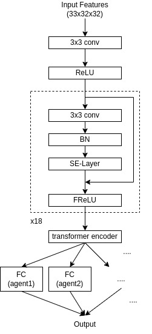

# Summary
Like many of the other participants, our final solution is imitation learning from top 2 agents using the almost same network architecture shared by [Sazuma's notebook](https://www.kaggle.com/shoheiazuma/lux-ai-with-imitation-learning).
Since it would not be desirable to train the network from a complete mixture of data from different agents, we prepared as many last FC-layers as the number of agents to learn, while the CNN architecture is shared.
In inference, we used only the FC-layer which is trained with the top agent.

# Model

- Channel Size: 384
- The actions of all units and all citytiles output by one forward.

We've noticed that the representation power of the network in the original notebook is insufficient, so inserted FReLU, SE-Layer, and transformer encoder. 
In addition, we increased as many layers and parameters as possible. In our model, in one turn, only one forward is executed, so we could save inference time and 
maximize the network's representation power (On average, it seems that it takes about 1.5sec per turn except for the first turn, which may need to load the model parameters.).
In terms of training error, validation error, and self-play results, we observed the improvements by this network architecture refinements.
  
# Training
- Optimizer: AdamW(lr=1e-03, weight_decay=1e-05)
- Epochs: 100
- LRScheduler: reduce the learning rate by 0.1 at the 50 epochs and 80 epochs.
- Loss: Weighted Softmax CrossEntropy (only reduce the weight for move center)
- Data Augmentation: Rotate 4 directions

It's worth mentioning that the number of epochs plays an important role. It costs the training time much (about 1 week for the final model), 
but through the self-plays and LB results, we observed that the model trained by many epochs showed better performance.

# Actions
Our actions model is not so different from others' solutions.
## Worker's Actions
- Move x 4
- Move Center
- Build City  
- Transfer x 4

## Citytile's Actions
- Research
- Build Worker
- Do Nothing

# Network Interpreter
Using the network's output itself as the output of the agents didn't give a satisfactory performance. So we added some rules to interpret the network's output. The followings are some examples.
- Prohibit workers go to the same cell except for citytile.
- Prohibit workers in the citytile go to the same citytile's cell. (If this is allowed, some multiple workers continue to take the same actions.)
- As to citytile's actions, the proportion of "Do Nothing" is so large and this prevents imitating the original agent correctly. 
  So in the situation where building workers is allowed, prioritized "Build Worker" in the order of the output score.
  
We've evaluated these rules through thousands of self-plays.

# Code
We published the code for the final model [here](https://github.com/takuwwwo/LuxAI).

# Dataset
Dataset for the final solution is uploaded [here](https://www.kaggle.com/bomac1/luxai-replay-dataset).
